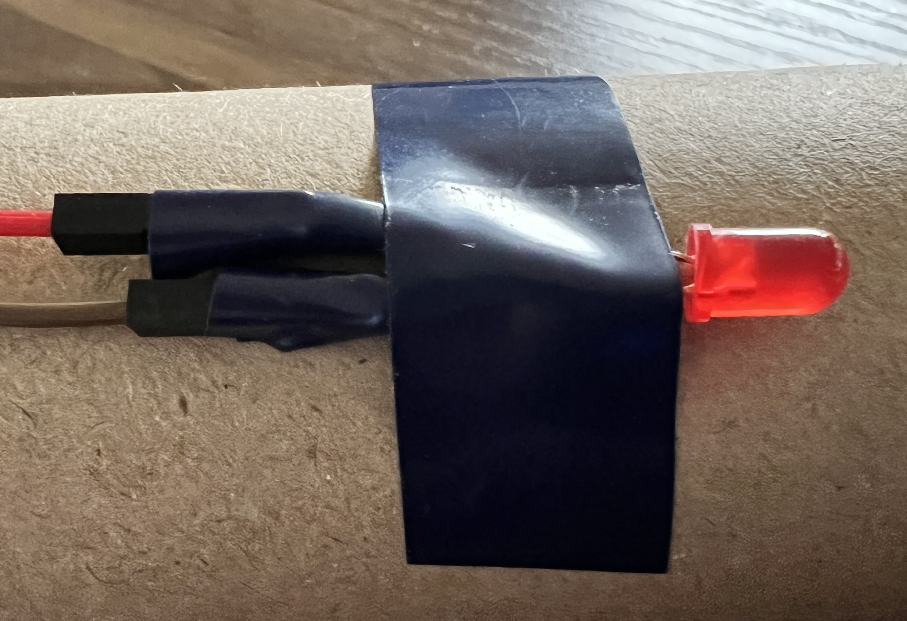

Use sticky tape or electrical tape to secure jumper wires to components or hold components in place so that your device stays together.

You can remove the tape later if you want to reuse the components.

