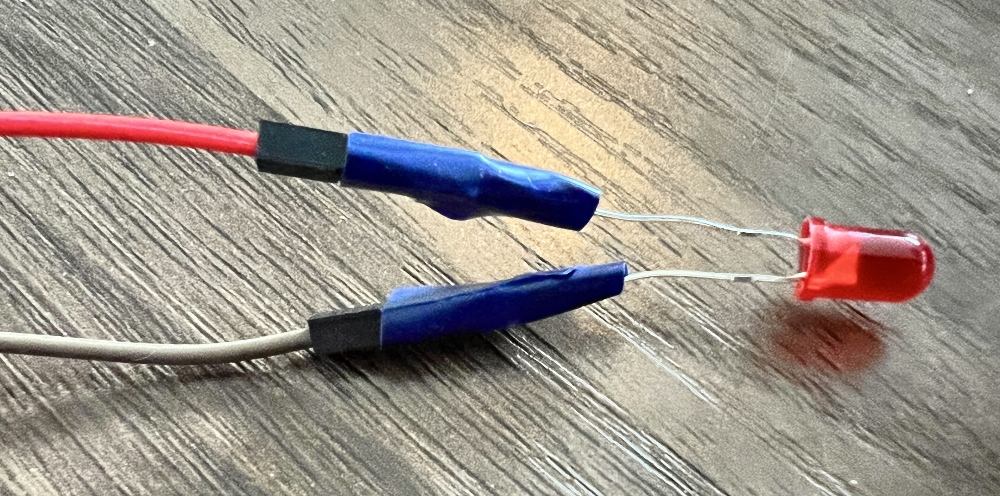

Gebruik plakband of isolatietape om verbindingsdraden vast te maken aan componenten of om componenten op hun plek te houden zodat je toestel bij elkaar blijft.

Je kunt de tape later verwijderen als je de onderdelen opnieuw wilt gebruiken.

